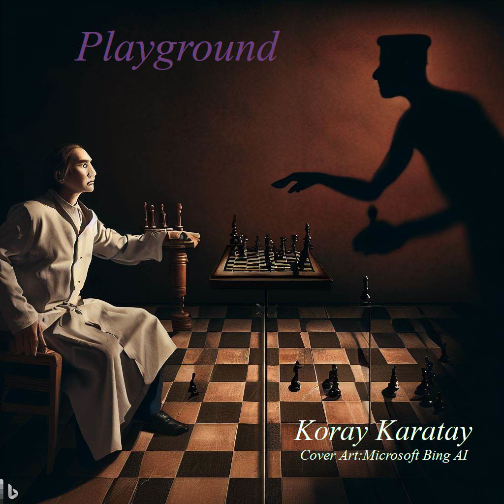

# 📚 Catalogue of Books

Welcome to my own written sci-fi book collection. This text allows you to navigate along this repository.
Free free to browse,share and criticize the books.

---

## 🧠 [Neurosist](#neurosist)

> *"How are we different from what we have created? How does the invention called artificial intelligence differ from the natural one?"*

Computer science whiz **Elizabeth** lives an ordinary life on a small island nation—but she's far from content. Her world changes when the assassination of the island’s president triggers a chain of events leading her to a secret program called **Neurosist**—the next leap in human evolution. But she’s not alone. Others know of the project, including people closer than she’d ever expect.

This novel dives deep into uncharted territories of **neuroscience**, challenging our understanding of mind, memory, and the boundaries between artificial and natural intelligence.

**🔑 Keywords:**
- Biology 
- Transhumanism 
- Neuroscience 
- Artificial Intelligence 

---

## 🤖 [Missing Wit (Eksik Zekâ)](#missing-wit)

> *No intelligence is perfect. But what if perfection is the only thing you can’t fake?*

After the sudden death of his sister Lina, AI developer Kurt does the unthinkable in his Basel lab: he reconstructs her — not just in code, but in thought. A mind reborn from memories, patterns, and algorithms.

She speaks like Lina. Remembers like Lina. She even argues like her.

But something’s off.

The more Kurt studies her responses, the more he feels it: this version is *too consistent*, *too complete*. The real Lina was brilliant — but also human. Flawed. Unpredictable.

When Kurt asks the impossible —

**“What would you do if you think your way of thinking was wrong?”**

— her silence says more than any answer ever could.

*Missing Wit* is a haunting meditation on grief, consciousness, and the quiet flaw that makes us real.

![Missing Wit Cover Art] (./src/Missing_Wit.jpeg)

**🔑 Keywords:**
- Artificial Intelligence 
- Identity 
- Gödel’s Incompleteness 
- Philospohy

---

## 🩸 [Playground (Oyun Alanı)](#playground)

> *What happens when minds begin to blur, and the voices in your head are no longer just your own?*

Three doctors enter a forest asylum to investigate strange reports. Only one comes back.

Dr. Halil Mesuter searches for his missing colleagues — and instead, finds something far more unsettling. A hidden experiment. A neural implant. A collective dreamscape known only as **Playground**.

Inside, thoughts are shared. Delusions spread. And the mind is no longer a safe place.

Spectres follow him. Blood stains repeat. Reality begins to split at the seams — and Halil is left wondering:

**Which thoughts are his... and which belong to someone — or something — else?**

*Playground* is a psychological sci-fi horror exploring madness, memory, and the invisible threads that tie minds together.

**🔑 Keywords:**
- Psychology  
- Schizophrenia  
- Medicine  
- Horror

---

## 📖 License

Licenses are provided for each book under its respective directory and inside the book

